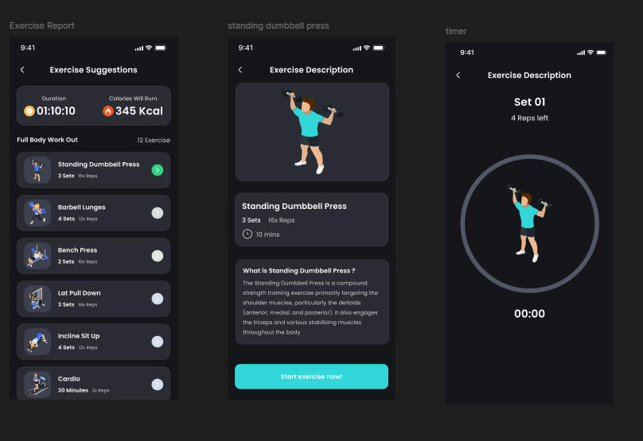
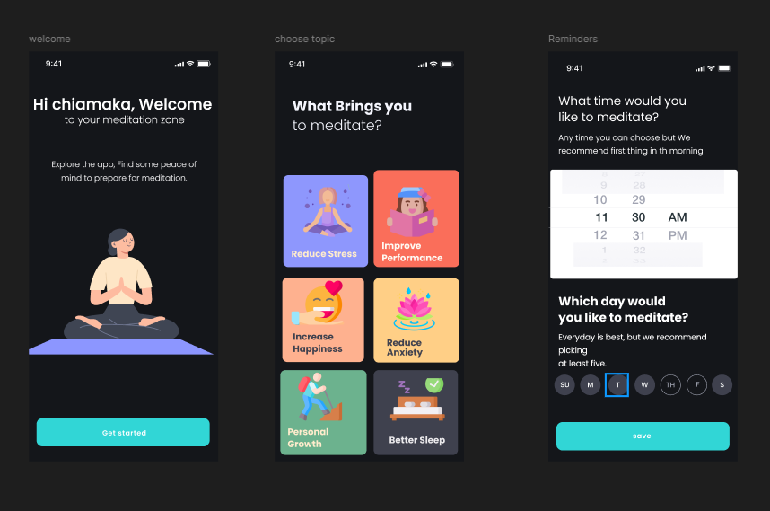

# Fitness App UI Design

A responsive wellness and health application UI design created in Figma.

## Project Overview

This project is a mobile fitness and wellness application designed to provide users with a simple and engaging way to monitor their fitness activities and maintain healthy habits.

## Design Focus

* Clean and intuitive user interface
* Easy navigation and user-friendly layouts
* Fitness and wellness tracking
* calorie and rest tracking
* Responsive mobile interface
* Consistent typography, spacing, and visual elements

## Tools

* Figma
* UI/UX Design

## My Role

UI/UX Designer

## Figma Design

[View the full design in Figma]https://www.figma.com/design/44zdbL7jWvuJ3IW7qYApoy/HEALTH-TRACKER-APP?node-id=0-1&t=xpTTNb2ZhXYQ5AUB-1

## App Screenshots

 
